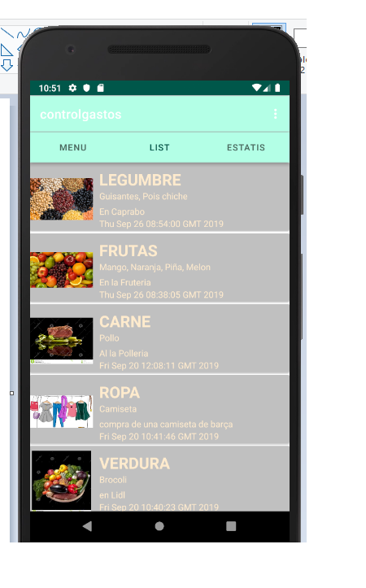
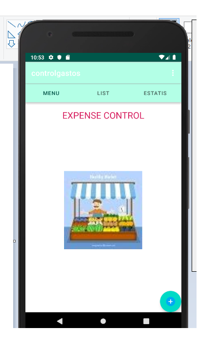

# CONTROL DE GASTOS


[]

[]
- [x] La primera screenshot es un formulario que nos permite añadir (insertar) un nuevo gasto para insertar en la BBDD
- [ ] Update the website
- [ ] Contact the media

[](https://travis-ci.org/joemccann/dillinger)

## Caracteristicas:

La aplicación nos permite conocer los gastos que tenemos en nuestra vida cotidiana. Es decir saber los gastos que hemos tenido por alquiler, gastos agua, comida, farmacia etc....

  - permite introducir los gastos, para su visualizacion en el emulador a traver uso de sqlite 
  - permite visualizar una lista de gastos a traver uso de sqlite 
  - permite la visualiazacion de las estadisticas de los gastos mas alto entre 2 fechas.

## Funcionamiento de la aplicacion!

### Menu de gastos



   - En esta pantalla puedes navegar entre las diferentes pantalla, tiene tambien el actionBar arriba.
		1. El boton floating add te lleva a la pantalla del formulario,
		2. hay una image que no hace nada fija dentro de la pantalla,
		3. Hay la parte de Viewpagers que tiene 3 contenedores y que cada uno te lleva a una pantalla diferente clicando sobre una cosa o otra cosa.
		4. hay el menu de los action bar que tienen 2 elementos que son action_settings que te lleva al formulario. y el action_helping que te enseña el lin del github.
		

### Formulario de Gastos

[Alt Text](doc/create_expensive.png)

  - En esta pantalla el usuario rellena los campos, pero primero si clica sobre el boton se le informara que tiene que rellanar los edittext.
		1. el campo categoria se despliega un spinner con los diferentes nombres de los productos que son verduras, frutas, legumbres, carnes etc...
		2. el campo de nombre te dice de introducir el nombre exacto del producto como son generales.
		3. el campo precio es precio de los productos.
		4. es la descripcion 
		5. es la descripcion del movimiento donde se ha echo la compra del producto.
		6. despues hay un boton que hacer la insercion de datos que es el boton create.
		7. el segundo boton es el boton GET IMAGE este boton te hace la foto por ejemplo de un ticket y te lo guarda en la galeria de imagenes.
	
### Lista de movimientos
	


  - Esta pantalla tiene un recyclerView que se ha utilizaso en vez de ListView.
		1. tiene un apdapter que carga los elementos row_model_xml
		2. Tiene un listener propio que permite ver el detalle del movimiento cuando se hace click sobre un item de la lista.
		3. Cada lista corresponde a una imagen del movimiento.
	
### Detalle del movimiento
	


  - Esta pantalla tiene el detalle de la lista.
		1. En cuando se clica sonre un item te saca la fecha en la que se ha echo el movimiento,
		2. la descripcion,
		3. la imagen.
		4. tiene un boton, y un edittext para borrar un movimiento a traver su codigo introciendolo dentro del edittext.
		5. el segundo boton aun no esta implementado.
		
### Estadisticas


  - En esta pantalla se compra entre 2 fechas para hacer el diagrama de los movimientos:.
		1. tiene 2 Edittext que permite introducir 2 fechas que son de inicio y fin:
		2. Y despues se da al boton que saca el diagrama de barras de movimiento en funcion del importe y el nombre,
				 
		

# las tablas estan creadas en sqlite

  - LA APLICACION ESTA BASADA EN CONTROLAR GASTOS DE UNA CASA.
  - Drag and drop images (requires your Dropbox account be linked)
  - 
    - Drag and drop images (requires your Dropbox account be linked)


You can also:
  - Import and save files from GitHub, Dropbox, Google Drive and One Drive
  - Drag and drop markdown and HTML files into Dillinger
  - Export documents as Markdown, HTML and PDF

Markdown is a lightweight markup language based on the formatting conventions that people naturally use in email.  As [John Gruber] writes on the [Markdown site][df1]

> The overriding design goal for Markdown's
> formatting syntax is to make it as readable
> as possible. The idea is that a
> Markdown-formatted document should be
> publishable as-is, as plain text, without
> looking like it's been marked up with tags
> or formatting instructions.

This text you see here is *actually* written in Markdown! To get a feel for Markdown's syntax, type some text into the left window and watch the results in the right.

### Tech

Dillinger uses a number of open source projects to work properly:

* [AngularJS] - HTML enhanced for web apps!
* [Ace Editor] - awesome web-based text editor
* [markdown-it] - Markdown parser done right. Fast and easy to extend.
* [Twitter Bootstrap] - great UI boilerplate for modern web apps
* [node.js] - evented I/O for the backend
* [Express] - fast node.js network app framework [@tjholowaychuk]
* [Gulp] - the streaming build system
* [Breakdance](http://breakdance.io) - HTML to Markdown converter
* [jQuery] - duh

And of course Dillinger itself is open source with a [public repository][dill]
 on GitHub.

### Installation

Dillinger requires [Node.js](https://nodejs.org/) v4+ to run.

Install the dependencies and devDependencies and start the server.

```sh
$ cd dillinger
$ npm install -d
$ node app
```

For production environments...

```sh
$ npm install --production
$ NODE_ENV=production node app
```

### Plugins

Dillinger is currently extended with the following plugins. Instructions on how to use them in your own application are linked below.

|XXX | README |
| ------ | ------ |
| Dropbox |TABLAS |
| GitHub | [plugins/github/README.md][PlGh] |
| Google Drive | [plugins/googledrive/README.md][PlGd] |
| OneDrive | [plugins/onedrive/README.md][PlOd] |
| Medium | [plugins/medium/README.md][PlMe] |
| Google Analytics | [plugins/googleanalytics/README.md][PlGa] |


### Development

Want to contribute? Great!

Dillinger uses Gulp + Webpack for fast developing.
Make a change in your file and instantanously see your updates!

Open your favorite Terminal and run these commands.

First Tab:
```sh
$ node app
```

Second Tab:
```sh
$ gulp watch
```

(optional) Third:
```sh
$ karma test
```
#### Building for source
For production release:
```sh
$ gulp build --prod
```
Generating pre-built zip archives for distribution:
```sh
$ gulp build dist --prod
```
### Docker
Dillinger is very easy to install and deploy in a Docker container.

By default, the Docker will expose port 8080, so change this within the Dockerfile if necessary. When ready, simply use the Dockerfile to build the image.

```sh
cd dillinger
docker build -t joemccann/dillinger:${package.json.version} .
```
This will create the dillinger image and pull in the necessary dependencies. Be sure to swap out `${package.json.version}` with the actual version of Dillinger.

Once done, run the Docker image and map the port to whatever you wish on your host. In this example, we simply map port 8000 of the host to port 8080 of the Docker (or whatever port was exposed in the Dockerfile):

```sh
docker run -d -p 8000:8080 --restart="always" <youruser>/dillinger:${package.json.version}
```

Verify the deployment by navigating to your server address in your preferred browser.

```sh
127.0.0.1:8000
```

#### Kubernetes + Google Cloud

See [KUBERNETES.md](https://github.com/joemccann/dillinger/blob/master/KUBERNETES.md)


### Todos

 - Write MORE Tests
 - Add Night Mode

License
----

MIT


**Free Software, Hell Yeah!**

[//]: # (These are reference links used in the body of this note and get stripped out when the markdown processor does its job. There is no need to format nicely because it shouldn't be seen. Thanks SO - http://stackoverflow.com/questions/4823468/store-comments-in-markdown-syntax)


   [dill]: <https://github.com/joemccann/dillinger>
   [git-repo-url]: <https://github.com/joemccann/dillinger.git>
   [john gruber]: <http://daringfireball.net>
   [df1]: <http://daringfireball.net/projects/markdown/>
   [markdown-it]: <https://github.com/markdown-it/markdown-it>
   [Ace Editor]: <http://ace.ajax.org>
   [node.js]: <http://nodejs.org>
   [Twitter Bootstrap]: <http://twitter.github.com/bootstrap/>
   [jQuery]: <http://jquery.com>
   [@tjholowaychuk]: <http://twitter.com/tjholowaychuk>
   [express]: <http://expressjs.com>
   [AngularJS]: <http://angularjs.org>
   [Gulp]: <http://gulpjs.com>

   [PlDb]: <https://github.com/joemccann/dillinger/tree/master/plugins/dropbox/README.md>
   [PlGh]: <https://github.com/joemccann/dillinger/tree/master/plugins/github/README.md>
   [PlGd]: <https://github.com/joemccann/dillinger/tree/master/plugins/googledrive/README.md>
   [PlOd]: <https://github.com/joemccann/dillinger/tree/master/plugins/onedrive/README.md>
   [PlMe]: <https://github.com/joemccann/dillinger/tree/master/plugins/medium/README.md>