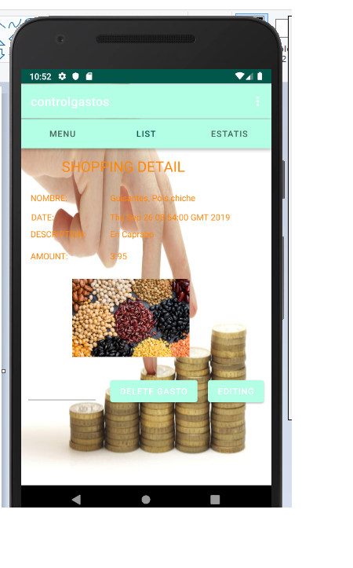
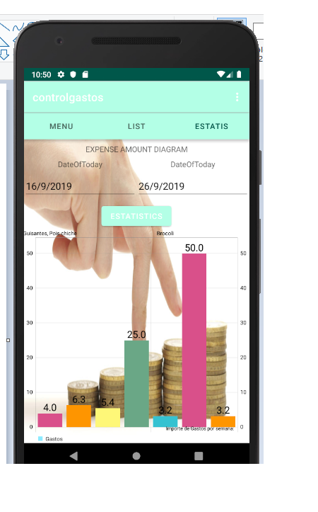

# CONTROL DE GASTOS

- [x] Descripcion de la aplicacion: 
La aplicación nos permite conocer los gastos que tenemos en nuestra vida cotidiana. Esta basada en SQLite con los query´s 
necesarios para la implementacion de la aplicacion.

## Caracteristicas:
  - permite introducir los gastos, para su visualizacion en el emulador a través del uso de sqlite 
  - permite visualizar una lista de gastos a través uso de sqlite 
  - permite la visualiazacion de las estadisticas de los gastos entre 2 fechas.
  - permite borrar un elemento en el recyclerView y deshacer el borrado
  
## Funcionamiento de la aplicacion!

### Menu de gastos

   - En esta pantalla puedes navegar entre las diferentes pantalla, tiene tambien el actionBar arriba.
		1. El boton floating add te lleva a la pantalla del formulario,
		2. hay una imagen fija que es el icono de la aplicación,
		3. Hay la parte de Viewpagers que tiene 3 contenedores y que cada uno te lleva a una pantalla diferente clicando sobre una cosa o otra cosa.
		4. hay el menu de los action bar que tienen 2 elementos que son action_settings que te lleva al formulario. 
		y el action_helping que te enseña el link del github donde esta la aplicacion.
		

### Formulario de Gastos

  - En esta pantalla el usuario rellena los campos, pero primero si clica sobre el boton se le informara que tiene que rellanar los edittext.
		1. el campo categoria se despliega un spinner con los diferentes nombres de los productos que son verduras, frutas, legumbres, carnes etc...
		2. el campo de nombre te dice de introducir el nombre del producto.
		3. el campo precio es precio de los productos.
		4. el campo descripcion es para describir el tipo de producto.
		5. el campo descripcion del movimiento donde se ha echo la compra del producto.
		6. despues hay un boton que hace la insercion de datos que es el boton create.
		7. el segundo boton es el boton GET IMAGE y en este boton te hace la foto por ejemplo de un ticket y te lo guarda en la galeria de imagenes.
		donde sale un dialogo de tipo alerta, el cual tiene 2 botones (hacer foto y galery y te lo guarde)
	
### Lista de movimientos
	

  - Esta pantalla tiene un recyclerView que se ha utilizaso en vez de un ListView.
		1. Tiene un apdapter que carga los elementos row_model_xml
		2. Tiene un listener propio que permite ver el detalle del movimiento cuando se hace click sobre un item de la lista.
		3. Cada elemento de la ista corresponde a una imagen del movimiento.
		4. Tambien se puede a través del ItemTouchHelper te permite borrar o recuperar un elemento.
	
### Detalle del movimiento
	

  - Esta pantalla tiene el detalle de la lista.
		1. En cuando se clica sobre un item te saca la fecha en la que se ha echo el movimiento,
		2. la descripcion,
		3. la imagen.
		
### Estadisticas

  - En esta pantalla se muestra los movimientos realizados entre 2 fechas.
		1. tiene 2 Edittext y cada Edittext un DatePicker que permite introducir 2 fechas que son de inicio y fin:
		2. Tiene un boton que saca el diagrama de barras de movimiento en funcion del importe y el nombre,
		 
## En la parte de codigo:  
  > Que son hay 3.
  - el modelo Categoria que tiene 2 atributos el codigo de tipo Long y el nombre de la categoria de tipo String.
  - el modelo de Producto a su vez tiene los atributos siguientes:
    * su codigo de tipo Long
    * su nombre de tipo String
    * su precio de tipo double
    * su descripcion de tipo String
    * un campo de imagen de tipo int
    * categoria de tipo Categoria
  - el modelo de Movimiento tiene los atributos siguientes:
    * su codigo de tipo Long
    * su importe de tipo double
    * producto de tipo Producto
    * fecha de tipo Date
    * descripcion de tipo String
> A continuacion se demuestra el diagrama
  

# Descripcion y creacion de las tablas!

## Las tablas

	- Entre las tablas Categorias Productos hay una relacion 1 a n
	- Y entre las tablas Productos y Movimeintos tambien
	- Estan relacionadas con su campo codigo que son de tipo Primary keys, Foreign Keys.
 
> A continuacion se demuestra esta relacion entre ellas: 

 

> Esta BBDD esta implementada en el fichero DataBaseHelper donde tenemos los siguientes metodos:

	- Create (Object object): devuelve Object,
    - Read(Long codigo) devuelve Object,
    - Update(Object object) devuelve Object,
    - Delete(Long codigo) devuelve boolean.
	
	
### Service:

#### MovimientoServiceImpl con su interfaz.

   - Create(Object object): devuelve Object,
   - Read(Long codigo) devuelve Object, 
   - Update(Object object) devuelve Object,
   - Delete(Long codigo) devuelve boolean.
   - getBetWeenDate(Date ini, Date fini): devuelve un ArrayList

#### ProductoServiceImpl con su interfaz.

   - Create(Object object): devuelve Object, 
   - Read(Long codigo) devuelve Object, 
   - Update(Object object) devuelve Object,
   - Delete(Long codigo) devuelve boolean.

#### CategoriaServiceImpl con su interfaz.

   - Create(Object object): devuelve Object, 
   - Read(Long codigo) devuelve Object, 
   - Update(Object object) devuelve Object,
   - Delete(Long codigo) devuelve boolean.

> Aqui dejo el link github de la aplicacion: [Control de GASTOS](https://github.com/Azo2013Github/controlgastos)

   